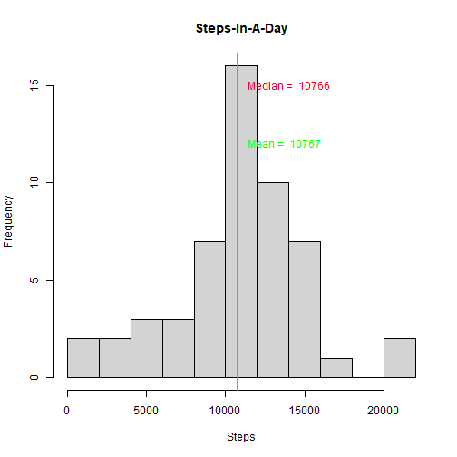
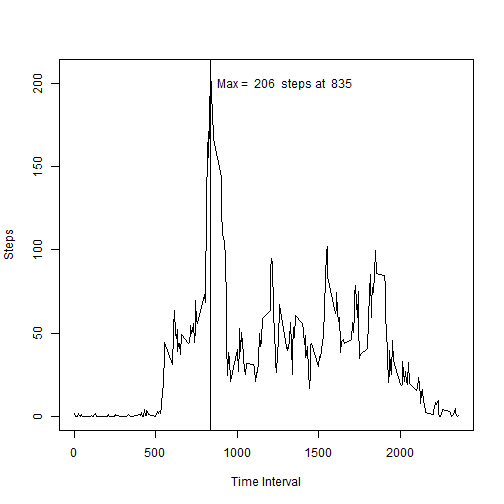
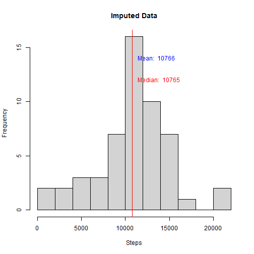
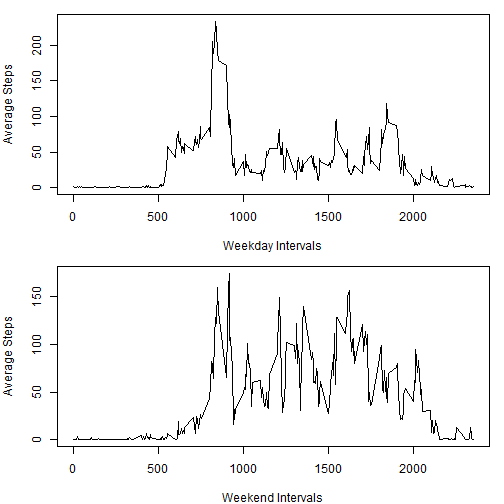

##Project 1
###Reproducible Research by Johns Hopkins University
###on Coursera

###1. Reading in the dataset and or processing the data

```r
activity <- read.csv("activity.csv")
activity$date <- as.Date(activity$date, "%Y-%m-%d")
```

###2. Histogram of the total number of steps taken each day

```r
activitySums <- aggregate(steps ~ date, activity, sum, rm.na = TRUE)
meanSums <- round(mean(activitySums$steps), 0)
medianSums <- median(activitySums$steps)

hist(activitySums$steps, breaks = 8, xlab = "Steps", main = "Steps-In-A-Day")
abline(v = meanSums, lwd = 2, col = "green")
text(11000, 12, paste("Mean = ", meanSums), col = "green", pos = 4)
abline(v = medianSums, col = "red")
text(11000, 15, paste("Median = ", medianSums), col = "red", pos = 4)
```



###3. Mean and median number of steps taken each day

```r
paste("Average number of steps taken each day: ", meanSums)
```

```
## [1] "Average number of steps taken each day:  10767"
```

```r
paste("Median number of steps taken each day: ", medianSums)
```

```
## [1] "Median number of steps taken each day:  10766"
```

###4. Time series plot of the average number of steps taken

```r
meanSteps <- aggregate(steps ~ interval, activity, mean)
maxInterval <- meanSteps[meanSteps$steps == max(meanSteps$steps),]

plot(meanSteps$interval, meanSteps$steps, type = "l", xlab = "Time Interval",
     ylab = "Steps")
abline(v = maxInterval$interval)
text (836, 200, paste("Max = ", round(maxInterval$steps, 0), " steps at ", 
                      maxInterval$interval), pos = 4)
```



###5. The 5-minute interval that, on average, contains the maximum number of 
###steps

```r
paste("Max time interval: ", maxInterval$interval)
```

```
## [1] "Max time interval:  835"
```

###6. Describe and show a strategy for imputing missing data
Reviewing the NA values in the steps field shows that missing step data occurs 
at the beginning and end extremities of the collection period. The removal of 
these records, because of this placement, will have no real effect on the
dataset.


```r
newActivity <- activity[!is.na(activity$steps),]
```

###7. Histogram of the total number of steps taken each day after missing values
###are imputed

```r
newSums <- aggregate(steps ~ date, newActivity, sum)
meanNewSums <- round(mean(newSums$steps))
medianNewSums <- median(newSums$steps)

hist(newSums$steps, breaks = 8, main = "Imputed Data", xlab = "Steps")
abline(v = meanNewSums, col = "blue")
text(11000, 14, paste("Mean: ", meanNewSums), pos = 4, col = "blue")
abline(v = medianNewSums, col = "red")
text(11000, 12, paste("Median: ", medianNewSums), pos = 4, col = "red")
```



###8. Panel plot comparing the average number of steps taken per 5-minute 
###interval across weekdays and weekends

```r
newActivity$weekday <- factor(weekdays(newActivity$date) %in% 
                              c("Monday", "Tuesday", "Wednesday",
                                "Thursday", "Friday"),
                              levels = c(TRUE, FALSE),
                              labels = c("Weekday", "Weekend"))

meanNewActivity <- aggregate(steps ~ interval + weekday, newActivity, mean)

par(mfrow = c(2,1), mar = c(4, 4, 1, 1))
plot(meanNewActivity$interval[meanNewActivity$weekday == "Weekday"], 
     meanNewActivity$steps[meanNewActivity$weekday == "Weekday"], 
     xlab = "Weekday Intervals", ylab = "Average Steps", type = "l")
plot(meanNewActivity$interval[meanNewActivity$weekday == "Weekend"],
     meanNewActivity$steps[meanNewActivity$weekday == "Weekend"], 
     xlab = "Weekend Intervals", ylab = "Average Steps", type = "l")
```


